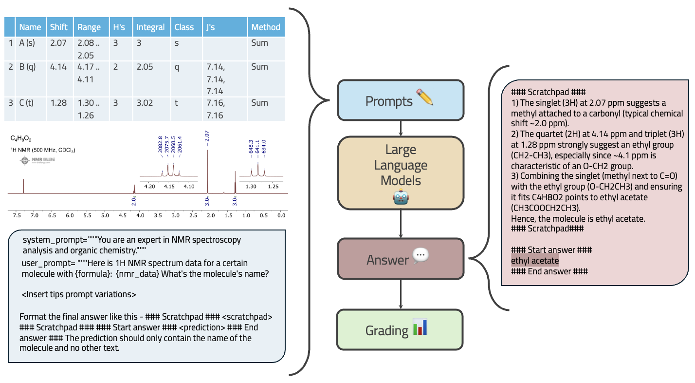

# LLM Spectroscopy: A Benchmark for Chemical Reasoning with AI

[](https://arxiv.org/abs/XXXXX)

## 🔍 Overview
**LLM-NMR** is a benchmark framework for evaluating the potential of large language models (LLMs) for solving Nuclear Magnetic Resonance (NMR) spectral analysis tasks through reasoning and domain knowledge.
<p align="center"> </p>

---

## Key Contributions

This repo includes:

* **Benchmark Dataset:**  115 NMR problems from Easy, Medium, and Hard difficulty levels sourced from [NMR-Challenge.com](https://nmr-challenge.uochb.cas.cz/)
* **Comprehensive LLM Evaluation:** An Inference script for running benchmark tasks on all LLMs with public facing APIs from OpenAI, Anthropic, and Google
* **Automated grading:** Tools for grading model outputs using SMILES, Tanimoto comparison, performance and scoring
*  **Systematic Analysis:** Experimental configuration for analysing effects temperature, prompting strategies, reasoning effort, and molecular formula inclusion.

---

## Quick Start

```bash
git clone https://github.com/ATOMSLab/LLM-NMR.git
cd LLM-NMR
pip install -r requirements.txt
```

**Required packages:**
`pandas`, `numpy`, `rdkit`, `cirpy`, `openai`, `anthropic`, `google-generativeai`, `json`, `matplotlib`, `seaborn`

---

## Basic Usage

### 1. Configure `.env`

Add your API keys:

```dotenv
OPENAI_API_KEY=...
ANTHROPIC_API_KEY=...
GOOGLE_API_KEY=...
```

### 2. Edit `config.py`

Set:

* Path to dataset JSON files
* Output directory for inference and grading
* Model settings (name, temperature,inference function to call etc.)

---

## 🚀 Run Benchmark

### Step 1: Run Inference

```bash
python3 main.py
```

Generates output CSV (configurable path), e.g.:

```csv
Id,Formula,Prediction
191,C4H8O2,"### Scratchpad ###...### Start answer ###Ethyl acetate### End answer ###"
```

### Step 2: Grade Outputs

```bash
python3 grade.py
```

This will:

* Extract final answer from LLM output
* Convert chemical names to SMILES using CIRpy
* Calculate Tanimoto similarity using RDKit against correct reference
* Score: 1 for exact match (similarity = 1.0), 0 otherwise
* Aggregate results for performance scores accross analytical dimensions

---

## 📁 Dataset

* Download JSON dataset from [Drive link]()
* Place it in the root directory (or update path in `config.py`)

### Composition:

| Difficulty | Count |
| ---------- | ----- |
| Easy       | 53    |
| Medium     | 38    |
| Hard       | 24    |
---

## 🧪 Models Tested

| Model             | Provider  | Type      |
| ----------------- | --------- | --------- |
| GPT-4o            | OpenAI    | Standard  |
| GPT-4o mini       | OpenAI    | Standard  |
| o1                | OpenAI    | Reasoning |
| o1-mini           | OpenAI    | Reasoning |
| o3-mini           | OpenAI    | Reasoning |
| Claude-3.5 Sonnet | Anthropic | Standard  |
| Gemini-2.0-Flash  | Google    | Standard  |


## ⚗️ Experiment Variables
* **prompting strategies** 

| Strategy | Description                    |
| -------- | ------------------------------ |
| P1       | Minimal instruction            |
| P2       | Chain-of-Thought (CoT)         |
| P3       | CoT + domain logic             |
| P4       | CoT + expert NMR tips          |
| P5       | CoT + knowledge + logic (full) |


* **Temperature:** `0.0`, `0.5`, `0.8`, `1.0`
* **Formula Inclusion:** with/without `molecular_formula`
* **Difficulty Tier:** Easy / Medium / Hard

---

## 📈 Results (With Formula)

| Model             | Accuracy | Rank |
| ----------------- | -------- | ---- |
| o1                | 69%      | 🥇   |
| o3-mini           | 65%      | 🥈   |
| Claude-3.5 Sonnet | 51%      | 🥉   |
| Gemini-2.0-Flash  | 38%      | 4th  |
| GPT-4o            | 25%      | 5th  |
| o1-mini           | 30%      | 6th  |
| GPT-4o mini       | 10%      | 7th  |

---

## 📚 Citation
If you use this work in your research, please cite:
```bibtex
@article{llm_spectroscopy_2025,
  title={LLM Spectroscopy: A Benchmark for Chemical Reasoning with AI},
  author={[Authors]},
  journal={...},
  year={2025}
}
```

---

## 🔗 Links

* 🔬 [NMR-Challenge.com](https://nmr-challenge.com) – source of benchmark problems
* 📂 [Download Dataset]() – (link to JSON dataset on Google Drive)
* 🧪 [RDKit Documentation](https://www.rdkit.org/docs/) – for SMILES handling and similarity metrics


